# gpu报告

## 1 环境说明

### 1.1 实验环境

> - [x] 显卡:GTX 1060 3GB 
> - [x] CPU: AMD 3090xt
> - [x] Memory: 内存64GB
> - [x] 环境证明: 
> 
> GPU证明
> <div align='center'>
> 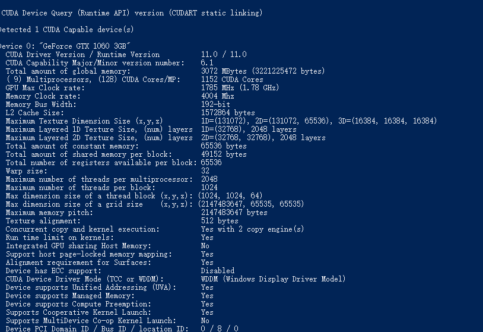
> </div>
> CPU证明
> <div align='center'>
> 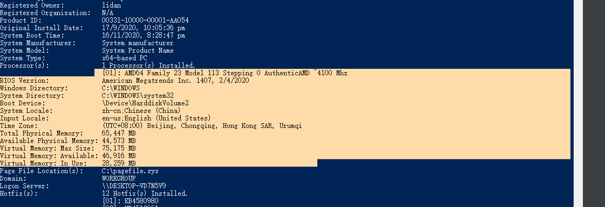
> </div>
### 1.2 计时说明
> 计时有两个标准
> - 第一个标准为：开始发送数据到gpu，到计算结果完全发送回cpu
> - 第二个标准为：核函数的执行时间。 

## 2 实验思路及结果

### 2.1 自碰撞检测

#### 2.1.1 gpu思路1
在caffe的实现中，贾扬青说到：将数据在CPU中进行展开，尽量减少GPU的访问显存的操作，这样可以提交性能。但是提高性能的同时会带来CPU的内存占用和显存的内存占用。可能会导致你必须将数据分块，这样碰撞检测的过程就变成了两个for循环，每个数据分块和每个分块之间的碰撞。 
> - 思路简述：
> ```text
> 1: 将数据展开，发送给GPU的是每个三角形的vertex数据的序列，而非是每个三角形的vertex索引序列和所有的vertex数据。
> 2. 将数据发送到gpu，通过tri_contact函数进行求交。
> ```
> - 方法优点 
> ```text
> 1. 从理论上来讲，通过显著减少GPU访问全局显存的次数（尽管GPU会有延迟掩藏，也无法完全消除），可以减少时间的浪费。
> ```
> - 方法坏处：
> ```text
> 1. 大量浪费了显存和内存，但是浪费是在常数倍限度内，并没有提升一个量级。
> ```
> - 实验结果计时：

> 全部GPU时间
> 
> 核函数时间
> 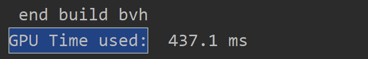
>-  实验结果显示
> 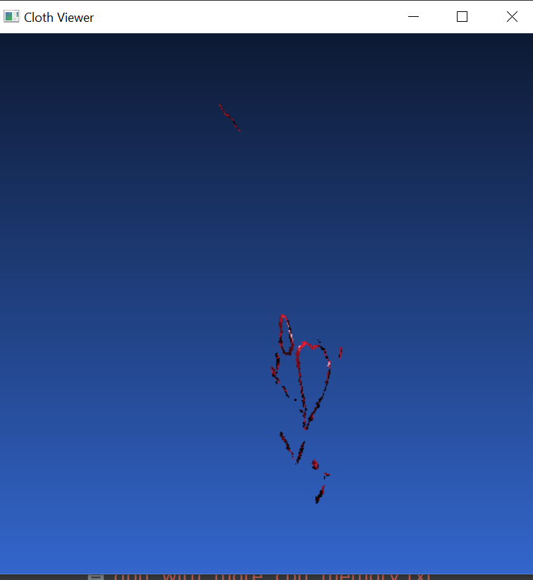

> - 核函数如下：
> 该代码仅仅使用了一次atomicadd操作，但是代码存在单个面片碰撞超过32时的计算结果，可能会出现错误。
> ```c++
> __global__ void  gpu_selfcheck(
>                                 vec3fcu* data,
>                                 vec3icu* dataid,
>                                 vec2fcu* res,
>                                 int* ressize,
>                                 int leftstart,
>                                 int leftsize,
>                                 int size)
> {
>     int blockid = gridDim.x*blockIdx.y + blockIdx.x ;
>     int threadid = blockDim.x * threadIdx.y + threadIdx.x ;
>     int threadsize = blockDim.x * blockDim.y ;
>     __shared__ int mutexx ;
>     __shared__ int contacted[32] ;
>     mutexx  = 0 ;
> 
>     if(blockid<leftsize && (blockid+leftstart)<size )
>     {
> 
>         int leftcur = (leftstart + blockid)*3  ;
>         vec3fcu leftdata1 = data[ leftcur ] ;
>         vec3fcu leftdata2 = data[ leftcur + 1] ;
>         vec3fcu leftdata3 = data[ leftcur + 2] ;
>         vec3icu leftid = dataid[leftstart+blockid] ;
> 
>         for( int i = leftcur+threadid*3+3 ; i < size*3  ; i += threadsize*3 )
>         {
> 
>             vec3fcu next1 = data[i] ;
>             vec3fcu next2 = data[i + 1] ;
>             vec3fcu next3 = data[i + 2] ;
>             vec3icu nextid = dataid[int(i/3)] ;
> 
>             bool cons = true ;
>             for(int g = 0 ; g< 3;g++)
>             {
>                 for(int h = 0 ; h <3 ;h++)
>                 {
>                     if(leftid[g]==nextid[h])
>                     {
>                         cons = false ;
>                         break ;
>                     }
>                 }
>             }
> 
>             if(cons&&cutri_contact(leftdata1,leftdata2,leftdata3, next1,next2,next3))
>             {
>                 int collusion_id = atomicAdd(&mutexx,1) ;
>                 contacted[collusion_id] = i/3;
> 
>             }
> 
>         }
> 
>         if(threadid<mutexx)
>         {
>             res[blockid*32+threadid+1] = vec2fcu(leftcur/3,contacted[threadid]) ;
>         }
>         if(threadid==0)
>         {
>             res[blockid*32] = vec2fcu(mutexx,leftcur/3) ;
>             *ressize += mutexx ;
>         }
> 
>     }
> }
> 
> ```


#### 2.1.2 gpu思路2
对于最普通的思路，就是全盘继承老师的代码，只不过提供一些关键数据结果和关键数据结构对应方法的GPU支持。
在实现过程中，我原来大量使用了Lock struct（参见Cuda by example），以及大量的同步，但是后来经过老师提点，我使用atomicAdd的返回值这个操作，重构了所有的代码，消除了所有的同步。
> - 思路简述：
> ```text
> 1: 将每个三角形的vertex索引序列和所有的vertex数据发送给GPU
> 2. 在gpu端构建三角形数据，通过tri_contact函数进行求交。
> ```
> - 方法优点 
> ```text
> 1. 中规中矩，内存和显存的占用较低。
> ```
> - 方法坏处：
> ```text
> 1. gpu需要在gpu端，通过三角形内部的vertex索引，从vertex数据中重建出整个三角形。
> ```
> - 实验结果计时：
> > 全部GPU时间
> > 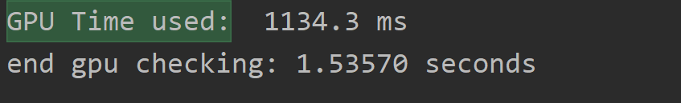
> > 核函数时间
> > 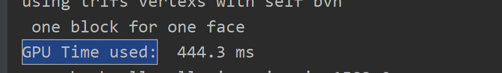
> > - 实验结果显示
> >
> >   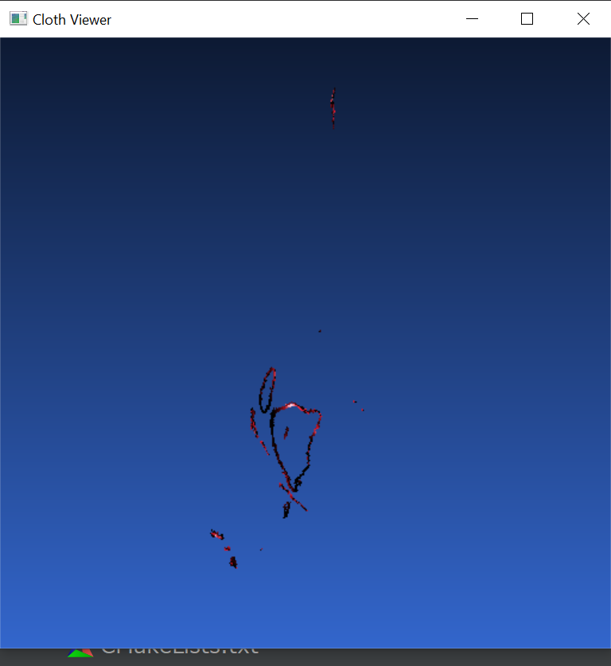
> >
> >   ```C++
> >   __global__ void  gpu_self_check_using_trifs(vec3fcu* vtxs,
> >                                               vec3icu* dataid,
> >                                               vec2fcu* res,
> >                                               int* ressize,
> >                                               int leftstart,
> >                                               int leftsize,
> >                                               int size)
> >   {
> >       int blockid = gridDim.x*blockIdx.y + blockIdx.x ;
> >       int threadid = blockDim.x * threadIdx.y + threadIdx.x ;
> >       int threadsize = blockDim.x * blockDim.y ;
> >       __shared__ int mutexx ;
> >       __shared__ int contacted[32] ;
> >       mutexx  = 0 ;
> >   
> >       if(blockid<leftsize && (blockid+leftstart)<size )
> >       {
> >   
> >           int leftcur = leftstart + blockid ;
> >           vec3fcu leftdata1 = vtxs[ dataid[leftcur].x ] ;
> >           vec3fcu leftdata2 = vtxs[ dataid[leftcur].y ] ;
> >           vec3fcu leftdata3 = vtxs[ dataid[leftcur].z ] ;
> >           vec3icu leftid = dataid[leftcur] ;
> >   
> >           for( int i = leftcur+threadid+1 ; i < size  ; i += threadsize )
> >           {
> >   
> >               vec3fcu next1 = vtxs[ dataid[i].x ] ;
> >               vec3fcu next2 = vtxs[ dataid[i].y ] ;
> >               vec3fcu next3 = vtxs[ dataid[i].z ] ;
> >               vec3icu nextid = dataid[i] ;
> >   
> >               bool cons = true ;
> >               for(int g = 0 ; g< 3;g++)
> >               {
> >                   for(int h = 0 ; h <3 ;h++)
> >                   {
> >                       if(leftid[g]==nextid[h])
> >                       {
> >                           cons = false ;
> >                           break ;
> >                       }
> >                   }
> >               }
> >   
> >               if(cons&&cutri_contact(leftdata1,leftdata2,leftdata3, next1,next2,next3))
> >               {
> >   //              记录所有的碰撞操作
> >                   int collusion_id = atomicAdd(&mutexx,1) ;
> >                   contacted[collusion_id] = i;
> >   
> >               }
> >   
> >           }
> >           if(threadid<mutexx)
> >           {
> >               res[blockid*32+threadid+1] = vec2fcu(leftcur,contacted[threadid]) ;
> >           }
> >           if(threadid==0)
> >           {
> >               res[blockid*32] = vec2fcu(mutexx,leftcur) ;
> >               *ressize += mutexx ;
> >           }
> >       }
> >   }
> >   ```
> >
> >   


#### 2.1.3 gpu思路3

在上面两种思路中，我们对每个三角形之间的相交关系均作判定，但是事实上，我们可以通过BVH这样的包围盒树，快速的过滤大量的没有意义的相交判定，而将相交操作完全限定于某些包围盒相交的三角形之间，这几乎将一个N*N的问题转变成了一个N问题，大大降低了算法的复杂度。但是构建BVH的方法有多种，目前比较流行的包围盒构建方法有3种，第一种为简单BVH，也就是借鉴gis中的KDTree的思想，每次寻找到最长的维度来划分包围盒，构建出整个BVH。 第二种为Morton BVH，也就是借鉴gis中morton码，来代替整个tree结构，因为计算机的0，1位本来就代表了树形分支，所以可以通过一个unsigned int来代表这个包围盒所在的区域位置。考虑到具体的实现难度和性价比（复杂的机制可能并不适合GPU），我们选择了简单BVH。
> - 思路简述：
> ```text
> 1: 给每个三角形构建一个包围盒，并不断merge，得到包含所有三角形包围盒的包围盒。
> 2. 递归的划分这个最大的包围盒，构建出BVH树。（划分选择最大维度上的中位数包围盒，这样可以保证平衡）
> 3. 将BVH树型结构转为树形数组。 
> 4. 将三角形数据，和BVH数组发送到GPU
> 5. 通过BVH限定碰撞检测的范围
> ```
> - 方法优点 
> ```text
> 1. BVH可以过滤较多没交的三角形，大大加速计算过程。
> ```
> - 方法坏处：
> ```text
> 1. 要记录整个BVH的求交的访问结果和过程，要使用stack和队列等。要耗费大量的shared memory，如果shared memory分配的较小，可能会导致相交关系的三角形变少。
> ```
> - 实验结果计时：
> > 全部GPU时间
> > 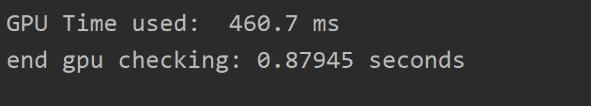
> > 核函数时间
> > 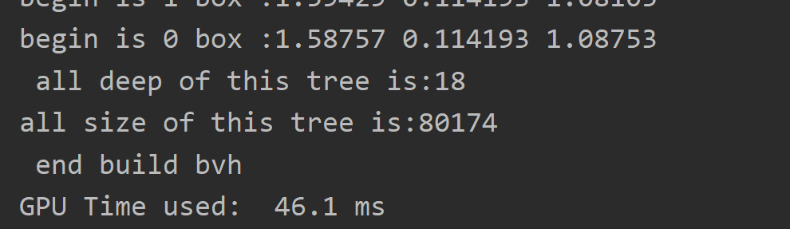
> > - 实验结果显示
> >  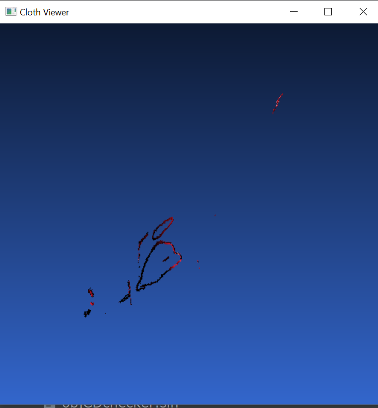
> >
> >   ```C++
> >   __global__ void  gpu_self_check_using_trifs(vec3fcu* data,
> >                                               vec3icu* dataid,
> >                                               vec2fcu* res,
> >                                               int* ressize,
> >                                               TreeBoundBox* bvhs,
> >                                               int bvhsize ,
> >                                               int size)
> >   {
> >       int blockid = gridDim.x*blockIdx.y + blockIdx.x ;
> >       int threadid = blockDim.x * threadIdx.y + threadIdx.x ;
> >       int threadsize = blockDim.x * blockDim.y ;
> >       __shared__ int mutexx[32] ;
> >       __shared__ int stack[32*32] ;
> >       __shared__ int result[32*32] ;
> >       mutexx[threadid]  = 0 ;
> >   
> >   
> >       int cur = ( blockid*threadsize+threadid)  ;
> >       if(cur<size)
> >       {
> >   
> >           int leftcur = cur*3  ;
> >           vec3fcu leftdata1 = data[ leftcur ] ;
> >           vec3fcu leftdata2 = data[ leftcur + 1] ;
> >           vec3fcu leftdata3 = data[ leftcur + 2] ;
> >           vec3icu leftid = dataid[cur] ;
> >   
> >   
> >           BoundBox box = BoundBox(leftdata1,leftdata2,leftdata3) ;
> >           //并将其带入到bvh 得到相撞的size
> >           int mysize = isInteracted(bvhs,box,cur,bvhsize,stack,result,threadid) ;
> >           for( int i = 0; i < (mysize>32?32:mysize)  ; i++ )
> >           {
> >               vec3fcu next1 = data[(result[threadid*32+i])*3] ;
> >               vec3fcu next2 = data[(result[threadid*32+i])*3 + 1] ;
> >               vec3fcu next3 = data[(result[threadid*32+i])*3 + 2] ;
> >               vec3icu nextid = dataid[(result[threadid*32+i])] ;
> >   
> >               bool cons = true ;
> >               for(int g = 0 ; g< 3;g++)
> >               {
> >                   for(int h = 0 ; h <3 ;h++)
> >                   {
> >                       if(leftid[g]==nextid[h])
> >                       {
> >                           cons = false ;
> >                           break ;
> >                       }
> >                   }
> >               }
> >   
> >   
> >               if(cons&&cutri_contact(leftdata1,leftdata2,leftdata3, next1,next2,next3))
> >               {
> >                   mutexx[threadid] = mutexx[threadid]+1 ;
> >                   if(mutexx[threadid]<31) res[cur*32+mutexx[threadid]] = vec2fcu(cur,result[threadid*32+i]) ;
> >               }
> >           }
> >           res[cur*32] = vec2fcu(mutexx[threadid],0) ;
> >           atomicAdd(ressize,mutexx[threadid]) ;
> >   
> >       }
> >   
> >   }
> >   ```

#### 2.1.4 cpu思路

使用cpu版本的BVH作为基础，我们可以得出如下的结果

> - 全局时间为：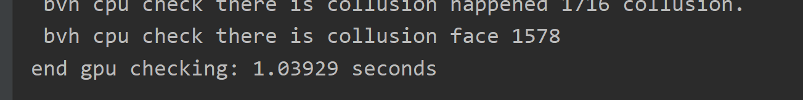
> - 最终结果为
> 

### 2.2 相互碰撞检测（补充说明）

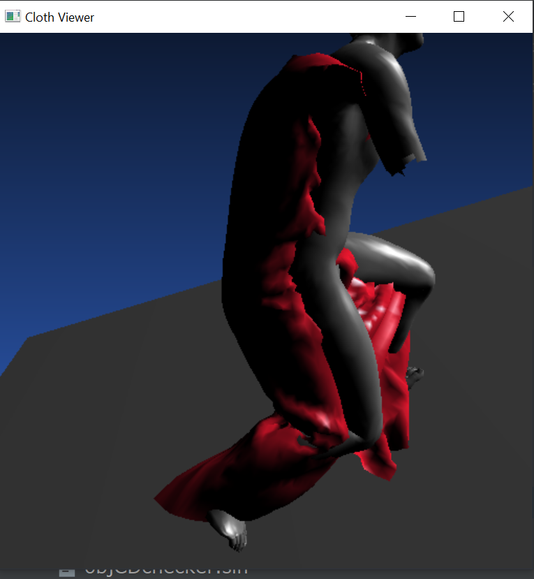
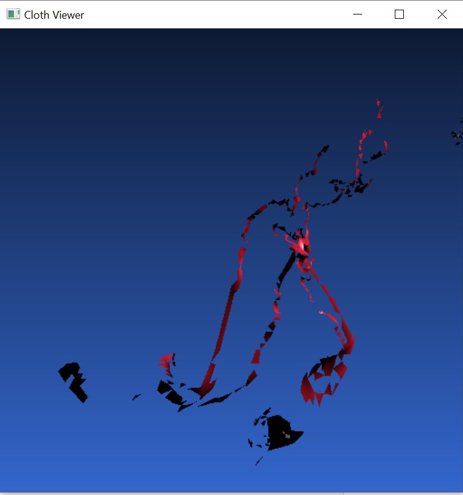
具体的性能比例，同self 碰撞差别不大。

## 3 遗留问题

因为1060的显卡限制，所以我使用了float数据结构，有时gpu和cpu的结果可能不同。但差别在10个以内。而且根据上文中的显示结果来看，结果差别并不大。我同样输出了结果在我代码的self_result文件夹中。

## 4 代码说明
> - self_result文件夹存放的是self_result检测结果
> - 您可以修改_Using_BVH_CPU_等宏定义 决定选择不同的方法。
> 
## 5 总结和展望
已知，GPU非常善于矩阵运算，nvdia的工程师显著的降低了矩阵运算的时间浪费，因此将所有的运算全部转变为矩阵运算将会大大增加算法的性能，因此我做这个提升性能的工作，我下一步的工作就是想办法将运算完全矩阵化，而且是超大型的矩阵化。
