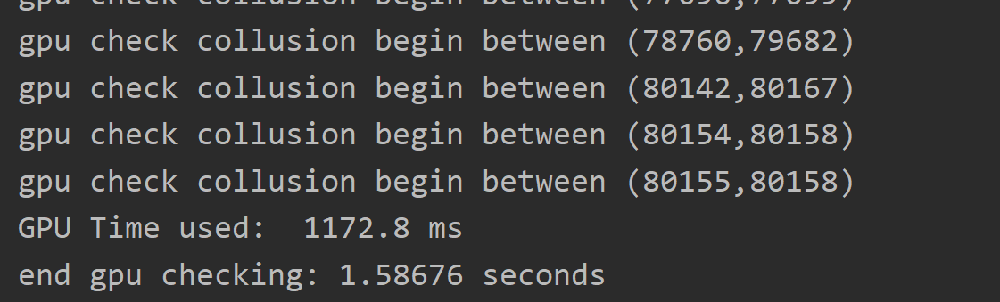

# gpu report for fast collision detection

## 1 Environment description

### 1.1 Experimental environment

> - [x] Graphics Card: GTX 1060 3GB
> - [x] CPU: AMD 3090xt
> - [x] Memory: 64GB
> - [x] Environmental certification:
>
> GPU proof
> <div align='center'>
> 
> </div>
> CPU proof
> <div align='center'>
> 
> </div>
### 1.2 Timing Description
> Timing has two standards
> - The first criterion is: start sending data to the gpu, until the calculation result is completely sent back to the cpu
> - The second criterion is: the execution time of the kernel function.

## 2 Experiment ideas and results

### 2.1 Self-collision detection

#### 2.1.1 GPU idea 1
In the implementation of caffe, Jia Yangqing said: expand the data in the CPU, and minimize the operation of the GPU to access the video memory, so that the performance can be improved. But improving the performance will also bring about the memory usage of the CPU and the memory usage of the video memory. It may cause you to have to divide the data into blocks, so that the process of collision detection becomes two for loops, each data block and the collision between each block.
> - Brief description of ideas:
> ```text
> 1: The data is expanded, and the sequence of vertex data of each triangle is sent to the GPU, rather than the sequence of vertex index and all vertex data of each triangle.
> 2. Send the data to the gpu, and perform intersection through the tri_contact function.
> ```
> - method advantages
> ```text
> 1. In theory, by significantly reducing the number of times the GPU accesses the global video memory (although the GPU will have a delay mask, it cannot be completely eliminated), the waste of time can be reduced.
> ```
> - method bad:
> ```text
> 1. A lot of video memory and memory are wasted, but the waste is within the limit of constant times, and it has not increased by an order of magnitude.
> ```
> - experiment result timing:

> total GPU time
> 
> Kernel time
> 
>- Experimental results show
> 

> - The kernel function is as follows:
> This code only uses an atomicadd operation, but the code has calculation results when a single face collision exceeds 32, and errors may occur.
> ```c++
> __global__ void gpu_selfcheck(
> vec3fcu* data,
> vec3icu* dataid,
> vec2fcu* res,
> int* ressize,
> int leftstart,
> int leftsize,
> int size)
> {
> int blockid = gridDim.x*blockIdx.y + blockIdx.x;
> int threadid = blockDim.x * threadIdx.y + threadIdx.x ;
> int threadsize = blockDim.x * blockDim.y;
> __shared__ int mutexx;
> __shared__ int contacted[32] ;
> mutexx = 0;
>
> if(blockid<leftsize && (blockid+leftstart)<size)
> {
>
> int leftcur = (leftstart + blockid)*3;
> vec3fcu leftdata1 = data[ leftcur ] ;
> vec3fcu leftdata2 = data[ leftcur + 1] ;
> vec3fcu leftdata3 = data[ leftcur + 2] ;
> vec3icu leftid = dataid[leftstart+blockid];
>
> for( int i = leftcur+threadid*3+3 ; i < size*3 ; i += threadsize*3 )
> {
>
> vec3fcu next1 = data[i];
> vec3fcu next2 = data[i + 1];
> vec3fcu next3 = data[i + 2];
> vec3icu nextid = dataid[int(i/3)];
>
> bool cons = true;
> for(int g = 0 ; g< 3; g++)
> {
> for(int h = 0 ; h < 3 ; h++)
> {
> if(leftid[g]==nextid[h])
> {
> cons = false;
> break ;
> }
> }
> }
>
> if(cons&&cutri_contact(leftdata1,leftdata2,leftdata3, next1,next2,next3))
> {
> int collision_id = atomicAdd(&mutexx,1) ;
> contacted[collusion_id] = i/3;
>
> }
>
> }
>
> if(threadid<mutexx)
> {
> res[blockid*32+threadid+1] = vec2fcu(leftcur/3,contacted[threadid]);
> }
> if(threadid==0)
> {
> res[blockid*32] = vec2fcu(mutexx,leftcur/3);
> *ressize += mutexx;
> }
>
> }
> }
>
> ```


#### 2.1.2 gpu idea 2
For the most common idea, it is to inherit the teacher's code in its entirety, but provide GPU support for some key data results and corresponding methods of key data structures.
In the implementation process, I used a lot of Lock struct (see Cuda by example) and a lot of synchronization, but after the teacher pointed out, I used the return value of atomicAdd to refactor all the code and eliminate all synchronization.
> - Brief description of ideas:
> ```text
> 1: Send each triangle's vertex index sequence and all vertex data to the GPU
> 2. Construct triangle data on the gpu side, and use the tri_contact function to intersect.
> ```
> - method advantages
> ```text
> 1. Moderate, low memory and video memory usage.
> ```
> - method bad:
> ```text
> 1. The gpu needs to reconstruct the entire triangle from the vertex data through the vertex index inside the triangle on the gpu side.
> ```
> - experiment result timing:
> > total GPU time
> > 
> > kernel function time
> > 
> > - Experimental results show
> >
> > 
> >
> > ```C++
> > __global__ void gpu_self_check_using_trifs(vec3fcu* vtxs,
> > vec3icu* dataid,
> > vec2fcu* res,
> > int* ressize,
> > int leftstart,
> > int leftsize,
> > int size)
> > {
> > int blockid = gridDim.x*blockIdx.y + blockIdx.x;
> > int threadid = blockDim.x * threadIdx.y + threadIdx.x ;
> > int threadsize = blockDim.x * blockDim.y;
> > __shared__ int mutexx;
> > __shared__ int contacted[32];
> > mutexx = 0;
> >
> > if(blockid<leftsize && (blockid+leftstart)<size)
> > {
> >
> > int leftcur = leftstart + blockid;
> > vec3fcu leftdata1 = vtxs[dataid[leftcur].x];
> > vec3fcu leftdata2 = vtxs[dataid[leftcur].y];
> > vec3fcu leftdata3 = vtxs[dataid[leftcur].z];
> > vec3icu leftid = dataid[leftcur];
> >
